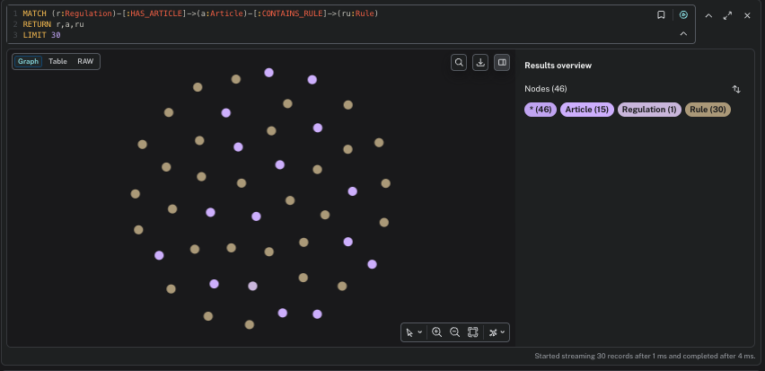
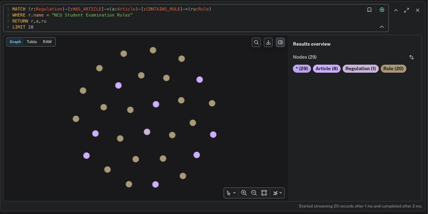
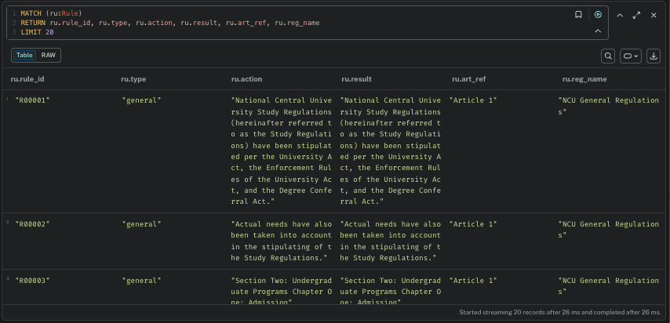

# Assignment 4 - KG-based QA for NCU Regulations

This project builds a Knowledge Graph (KG) from NCU regulation PDFs, retrieves relevant rule evidence from Neo4j, and returns grounded answers.

## KG Schema Design

The graph follows the required assignment contract:

- `(:Regulation)-[:HAS_ARTICLE]->(:Article)-[:CONTAINS_RULE]->(:Rule)`
- `Article` properties:
  - `number`
  - `content`
  - `reg_name`
  - `category`
- `Rule` properties:
  - `rule_id`
  - `type`
  - `action`
  - `result`
  - `art_ref`
  - `reg_name`
- Fulltext indexes:
  - `article_content_idx`
  - `rule_idx`

### Design Notes

- `Regulation` stores document-level metadata.
- `Article` stores full article text to preserve legal context.
- `Rule` stores granular statements extracted from article sentences for higher retrieval precision.
- Query flow uses typed + broad retrieval:
  - Typed: query `rule_idx` directly for rule-focused evidence.
  - Broad: query `article_content_idx`, then route to connected `Rule` nodes.
- Final answers always cite source regulation and article.

## Screenshots (Key Nodes and Relationships)

Please replace the placeholders below with your actual Neo4j screenshots before submission.

### Graph Overview



### Regulation -> Article -> Rule Links



### Rule Node Properties



## Setup

### 1) Start Neo4j (Docker)

```bash
docker run -d --name neo4j -p 7474:7474 -p 7687:7687 -e NEO4J_AUTH=neo4j/password neo4j:latest
```

### 2) Install dependencies

```bash
python -m venv .venv
source .venv/bin/activate
pip install -r requirements.txt
```

## Run Pipeline

Run in repository root:

```bash
python setup_data.py
python build_kg.py
python query_system.py
python auto_test.py
```

## Files Included

- `README.md` (this report)
- `auto_test.py`
- `build_kg.py`
- `llm_loader.py`
- `query_system.py`
- `requirements.txt`
- `.gitignore`
